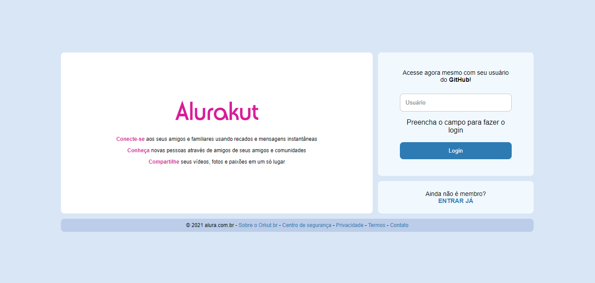

# Imersão React - Alurakut

## 💻 Sobre o projeto

O projeto Alurakut foi desenvolvido durante a [Imersão React 03](https://alura.com.br/imersao-react) da [Alura](https://www.alura.com.br/), onde o objetivo era recriar o Orkut utilizando as ferramentas [React](https://pt-br.reactjs.org/) e [Next.js](https://nextjs.org/).

[🌐 Site do Projeto](https://alurakut-alanabacco.vercel.app/)

---

## 🖼️ Imagens

  
  <legend>Página de Login</legend>

---

## Funcionalidades

- Página de Login;
- Página de Perfil.

---

## 🛠 Tecnologias utilizadas

As seguintes ferramentas foram utilizadas na construção desse projeto:

  

---

### [🌐 Ver a página do Projeto](https://alurakut-alanabacco.vercel.app/)

---

### Desenvolvido por [Alana Bacco](https://github.com/alanabacco).  
